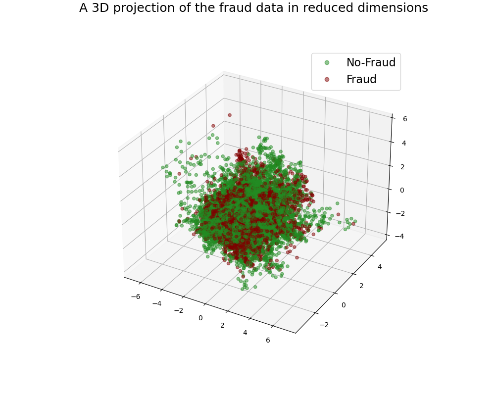

## About Me
- 💻I am carrying out DEM simulations in the open source code LAMMPS
- 🎮I created an Android App
- 🏃 One of my passions is running 
- 🎷 I play saxophone  

## PhD Project: DEM study of the behaviour of granular materials during drained cyclic loading

The PhD project focused on the behaviour of granular materials subjected to drained cyclic loading. These conditions can be found adjacent to integral bridge abutments and wind turbines with monopile foundation and these applications are the primary motivations for the research. 
  
Europe is one of the leaders in the offshore wind market and Europe aims to achieve a climate-neutral, low-carbon economy by 2050. One of the most expensive components of an offshore fixed-bottom (monopile) wind turbine construction is the assembly and installation of the substructure and foundation which is estimated to comprise 23.3% of the total cost in the 2021 Cost of Wind Energy Review. Monopile foundations are typically 30 - 40m in length and they are vulnerable to tilt. Exceeding the design limits for tilt could lead to high repair costs and potentially compete shutdown of the structure.
  
Integral bridges are bridges which do not have joints and bearings. In conventional bridges there is damage of the joints due to de-icing salts and accumulation of debris between the joints. This leads to a significant amount of maintenance which has to be carried out on those bridges. In integral bridges the abutment is rigidly connected to the deck. As the deck expands and contracts with temperature changes (Summer - Winter / Day - Night), the abutment is subjected to a cyclic movement. This movement leads to settlement of the backfill soil adjacent to the abutment and build-up of earth pressure. Currently there is no guidance in the Eurocodes on the earth pressure build up and the developing settlement throughs behind integral bridges. There are two UK guides on integral bridges. Some insight into soil behaviour has been obtained using physical centrifuge models and settlement tests. My study aimed to further advance understanding of drained cyclic loading using discrete element method (DEM) simulations.

  
## Molecular Dynamic Simulations in LAMMPS (SSH)(HPC)(C++)

 I have been using an open-source molecular dynamics code called LAMMPS (Large-scale Atomic/Molecular Massively Parallel Simulator) to create samples up to 150k particles. The particles represent sand samples and are loaded cyclically to simulate conditions adjacent to integral bridge abutments. The samples can consist of spheres or clumps (two over lapping spheres). A smaller sample of about 8k clumps is represented below. Properties such as particle movement, contact number, stresses etc are output throughout the simulation resulting in large quantities of data to be processed. The simulations are run on the imperial college high-performance computing (HPC) cluster.

  

  

## Project 1 (Classification): Airline Passenger Satisfaction 
The data for this project was obtained from Kaggle.com and is already divided into training and testing datasets. First an overview of the data is provided for this both the training and testing data was used. Next, a Random Forest Classifier was applied to the training data set. Subsequently, predictions were then made on the testing data set. The model was evaluated using a confusion matrix and calculating metrics such as sensibility and precision. Furthermore, a linear regression model was trained and evaluated. Both models were then compared against each other using ROC curves. The repo for this project can be found [here](https://github.com/TaraSassel/Airline_Passenger_Satisfaction).

## Android Game (Java)

### The Game
The game was created in Android Studio using Java and is avaliable on [Google Play](https://play.google.com/store/apps/details?id=com.bleachheartprojects.soiled). It follows a simple concept where the main character can be moved left or right by pressing on the left or right half of the screen. The goal is it to avoid the falling objects unless a hammer has been collected in which case the user can destroy the objects and collect points. The falling assets are called triaxial apparatus which is an equipment used in geotechnical engineering for soil testing. The background is Queens Tower which is located a Imperial College London. When losing the game, the following quote appears "You got soiled". 

  

The main character is animated by looping through different images scaled according to screen width which are updated every few milliseconds when walking left or right. The images have been created in Gimp which is an image editor in a pixel art style. Booleans (true or false conditions) are used to determine if the character is walking or not, left or right, and if the character has collected a hammer in which case the arms get replaced by an arm holding a hammer.

An invisible square box is placed around the character and the falling objects. If the two collide the game is either lost or a point is collected depending on if the main character is currently in possession of a hammer.

### Online Leaderboard
The online Leaderboard system is connected to Google Firebase, where the data in this case the username and score and timestamp is submitted to an online database if the user wishes to do so. Equally if the user wishes to view the Leaderboard the data of the first top 50 players is retrieved from Firebase.

  

<!--
## Particle Contact Force (Python)
When working with LAMMPS a lot of different information is generated throughout the simulation. One of which is the contact-force information of all the particles within the sample. This information can be obtained at different predefined intervals and given in forms of text files. Using this information, the two figures below were generated with python where the Pandas, Numpy and Matpoltlib libraries were applied. The figures show three rose diagrams for the xy, yz and yz plane. The bar size depends on the number of contacts and the orientation is dependant on the direction of the contact force. The bars are coloured according to the average magnitude of contact forces in the given direction.  
The script can be found [here](./scripts/contactForceRoseAllPlanesGit.py).

_**Initial Contact Force Orientation**_

  

_**Final Contact Force Orientation**_

  

-->

## Fraud Data Classification
### Abstract 

For this project the data from Kaggel was used (https://www.kaggle.com/datasets/girishvutukuri/insurance-fraud).
A quick overview of the data is provided in a first step where some of the methods that were applied to filter the data are explained. 
Two methods to classify the data are explored using sklearn, Logistic Regression and Random Forest. And will be discussed in more detail. 
The notebook to this project can be found here.
 

### Data Overview

5 different csv files provided in this data set which are:

- Demographics Data  
- Policy Information  
- Claim Information  
- Vehicle Data  
- Fraud Data   

The data provided is already divided into test and training data. However, the fraud data was only provided for the training dataset. In order to evaluate the model performance it was decided to divide the training dataset as well. This evaluation was carried out by creating a confusion matrix and calculating the F1 score, accuracy,  precision and recall.

_**Fraud Overview**_

  (a)
  (b)

The above Figure provides a quick overview of the training dataset. It can be observed that Fraud is a big problem to the insurance company as about a quarter of the cases show fraud. These fraudulent cases can significantly diminish the company’s profit. 173M was the total amount claimed between the beginning of January to the end of March from cases that were identified as fraud. In comparison, 431M was the amount paid out to sincere cases. 
From Figure (b) it can be observed that in case of fraud the amount of total claim is mostly above 30k where some of the highest amounts claimed can be dishonest cases. However, the typical range is identical to the non-fraudulent cases.  

It is key to identify fraudulent cases accurately, wrongly accusing customers would result in a decrease in customers; therefore, it is necessary to keep "False Positives" to a minimum.

  

## Model Training 

### Logistic Regression

Logistic regression is a method that enables the classification of data. It was found that this was an  appropriate method as there were only two categories, fraud or no fraud. 
 

_**Confusion Matrix**_

  

### Random Forest 
_**Confusion Matrix**_

  

(In progress)
