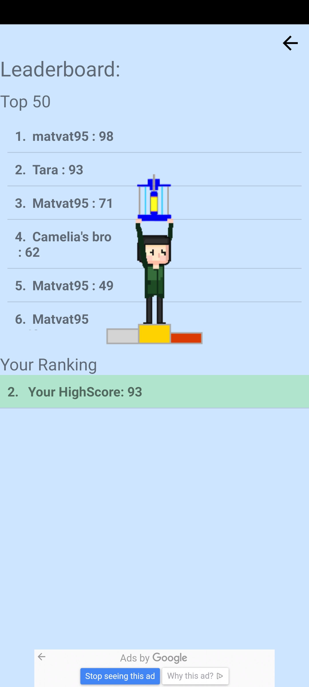

## Hi my name is Tara and I am currently a final year PhD candidate at Imperial College London.
- 💻I am carrying out Molecular Dynamics simulations in the open source code LAMMPS
- 🏃 One of my passions is running 
- 🎷 I play saxophone  

## PhD Project: Analysing Earth Pressure Build-Up Behind Integral Bridge Abutments

Integral bridges are bridges which do not have joints and bearings. In conventional bridges there is damage of the joints due to de-icing salts and accumulation of debris between the joints. This leads to a significant amount of maintenance which has to be carried out on those bridges. In integral bridges the abutment is rigidly connected to the deck. As the deck expands and contracts with temperature changes (Summer - Winter / Day - Night), the abutment is subjected to a cyclic movement. This movement leads to settlement of the backfill soil adjacent to the abutment and build-up of earth pressure. Currently there is no guidance in the Eurocodes on the earth pressure build up and the developing settlement throughs behind integral bridges. There are two UK guides on integral bridges. Some insight into soil behaviour has been obtained using physical centrifuge models and settlement tests. My study aims to further advance understanding using discrete element method (DEM) simulations.

  
## Project 1: Particle Contact Force (Python)
When working with LAMMPS a lot of different information is generated throughout the simulation. One of which is the contact-force information of all the particles within the sample. This information can be obtained at different predefined intervals and given in forms of text files. Using this information, the two figures below were generated with python where the Pandas, Numpy and Matpoltlib libraries were applied. The figures show three rose diagrams for the xy, yz and yz plane. The bar size depends on the number of contacts and the orientation is dependant on the direction of the contact force. The bars are coloured according to the average magnitude of contact forces in the given direction.  
The script can be found [here](./scripts/contactForceRoseAllPlanesGit.py) with a [data file](./scripts/dump800000000.contact) to be used with it.

_**Initial Contact Force Orientation**_

  

_**Final Contact Force Orientation**_

  

## Project 2: Android Game (Java)

### The Game
The game was created in Android Studio using Javaand is avaliable on Google Play. It follows a simple concept where the main character can be moved left or right by pressing on the left or right half of the screen. The goal is it to avoid the falling objects unless a hammer has been collected in which case the user can destroy the objects and collect points. The falling assets are called triaxial apparatus which is an equipment used in geotechnical engineering for soil testing. The background is Queens Tower which is located a Imperial College London. When losing the game, the following quote appears "You got soiled". 

  

The main character is animated by looping through different images scaled according to screen width which are updated every few milliseconds when walking left or right. The images have been created in Gimp which is an image editor in a pixel art style. Booleans (true or false conditions) are used to determine if the character is walking or not, left or right, and if the character has collected a hammer in which case the arms get replaced by an arm holding a hammer.

An invisible square box is placed around the character and the falling objects. If the two collide the game is either lost or a point is collected depending on if the main character is currently in possession of a hammer.

### Online Leaderboard
The online Leaderboard system is connected to Google Firebase, where the data in this case the username and score and timestamp is submitted to an online database if the user wishes to do so. Equally if the user wishes to view the Leaderboard the data of the first top 50 players is retrieved from Firebase.

  

